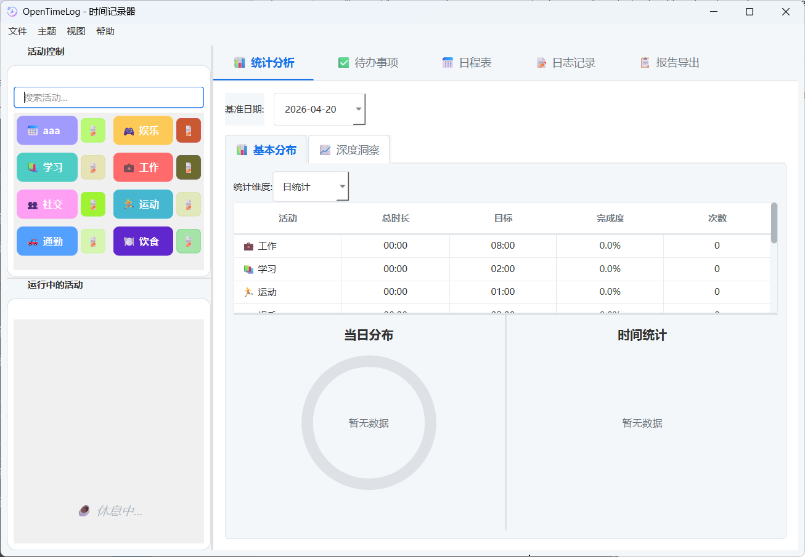
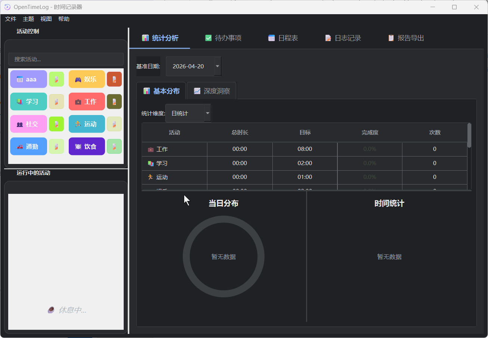
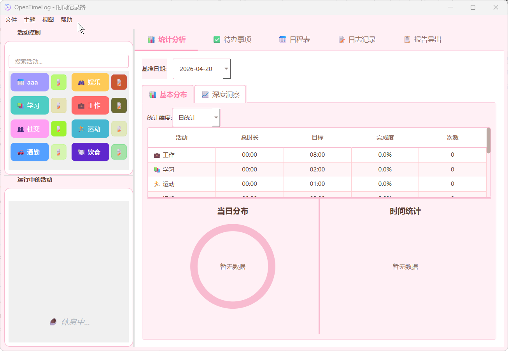
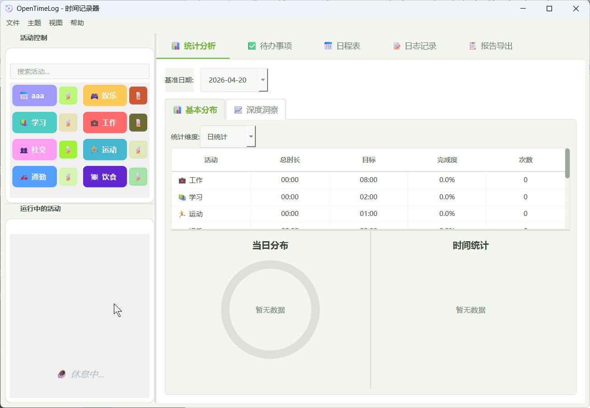

# OpenTimeLog

<div align="center">

**A professional, open-source desktop time tracking tool built with PySide6.**  
*The PC-native alternative for time-logging enthusiasts.*

[](https://www.python.org/)
[](https://doc.qt.io/qtforpython/)
[](LICENSE)
[]()
[]()

[English](#english) · [中文](#中文)

</div>

---

## English

### 📖 Introduction

**OpenTimeLog** is an open-source, privacy-first desktop time tracking application built with Python and PySide6. It helps you record, analyze, and understand how you spend your time — entirely on your local machine, with no data ever leaving your device.

> This is an **independent, original project** developed from scratch.  
> It is NOT affiliated with, authorized by, or endorsed by the creators of aTimeLogger or any other time tracking software.

---

### ✨ Features

- 🕐 **One-click activity timing** — Start and stop activities instantly
- 📊 **Statistics & Charts** — Daily/weekly/monthly breakdowns with pie charts and bar graphs
- 🪟 **Mini Floating Window** — A lightweight always-on-top widget showing the current timer, pause/resume, and quick-return button
- 🎨 **4 Built-in Themes** — Switch between themes to match your workflow:
  - ☀️ Default Light
  - 🌙 Professional Dark
  - 🌸 Warm Pink
  - 🌿 Eye Protection Mode
- 📋 **To-Do List** — Integrated task management
- 📅 **Schedule Manager** — Visualize and manage your day with reminders
- 📓 **Daily Journal Log** — Add notes to your tracked activities
- 📤 **Report Export** — Export data to CSV / HTML with deep analysis
- 🔒 **100% Local Data** — No accounts, no cloud, no telemetry. Your data stays on your machine.
- 🖥️ **Cross-platform** — Runs on Windows, macOS, and Linux

---

### 📸 Screenshots

| Default Light | Professional Dark |
|:---:|:---:|
|  |  |

| Warm Pink | Eye Protection |
|:---:|:---:|
|  |  |

**Mini Floating Window:**


---

### 🚀 Getting Started

#### Requirements

- Python 3.10+
- PySide6 6.x

#### Installation

```bash
# Clone the repository
git clone https://github.com/yourusername/OpenTimeLog.git
cd OpenTimeLog

# Install dependencies
pip install -r requirements.txt

# Run the application
python main.py
```

#### Build Installer (Windows)

```bash
# Using the provided build script
build.bat
```

> The project includes an [Inno Setup](https://jrsoftware.org/isinfo.php) script (`时间记录器.iss`) for generating a Windows installer.

---

### 📦 Project Structure

```
OpenTimeLog/
│
├── main.py                     # Application entry point
├── config.json                 # User configuration
├── requirements.txt            # Runtime dependencies
├── requirements-test.txt       # Test dependencies
├── build.bat                   # Windows build script
│
├── core/                       # Business logic layer
│   ├── config.py               # Config management
│   ├── database.py             # SQLite database interface
│   ├── models.py               # Data models
│   ├── time_calculator.py      # Time computation utilities
│   └── system_utils.py         # OS-level utilities
│
├── ui/                         # Presentation layer
│   ├── main_window.py          # Main application window
│   ├── dialogs/                # Modal dialogs
│   │   ├── add_activity.py     # Add new activity
│   │   ├── edit_log.py         # Edit existing log entry
│   │   ├── manual_log.py       # Manually add a time log
│   │   └── help_dialog.py      # In-app help viewer
│   ├── widgets/                # Reusable UI components
│   │   ├── activity_control.py # Activity list & controls
│   │   ├── running_activity.py # Currently running timer panel
│   │   ├── floating_timer.py   # Mini floating window
│   │   ├── statistics.py       # Statistics tab
│   │   ├── chart_widgets.py    # Chart components
│   │   ├── daily_log.py        # Daily log view
│   │   ├── todo_list.py        # To-do list widget
│   │   ├── schedule_manager.py # Schedule & reminder widget
│   │   ├── report.py           # Report export widget
│   │   ├── activity_note.py    # Activity note/journal
│   │   └── admin_dashboard.py  # Admin/debug dashboard
│   ├── styles/                 # Theming system
│   │   ├── app_style.py        # Theme loader & switcher
│   │   └── themes/             # QSS stylesheets
│   │       ├── male_theme.qss  # Default Light / Professional Dark
│   │       └── female_theme.qss# Warm Pink / Eye Protection
│   └── utils/
│       └── time_picker.py      # Custom time picker widget
│
├── utils/                      # Shared utilities
│   ├── helpers.py              # General helper functions
│   ├── log_manager.py          # Application logging
│   ├── report_analyzer.py      # Report data analysis
│   ├── report_parser.py        # Report parsing logic
│   └── schedule_reminder.py    # Reminder notification system
│
├── data/                       # Local database storage
│   └── timelog.db              # SQLite database (auto-generated)
│
├── resources/                  # Static assets
│   ├── main.ico                # Application icon
│   └── help/                   # Built-in help documentation
│       ├── index.html
│       └── style.css
│
└── tests/                      # Automated test suite
    ├── conftest.py
    ├── test_core/
    │   ├── test_database.py
    │   ├── test_models.py
    │   └── test_time_calculator.py
    ├── test_integration/
    │   └── test_workflows.py
    ├── test_ui/
    │   └── test_widgets.py
    └── test_utils/
        ├── test_log_manager.py
        └── test_schedule_reminder.py
```

---

### 🧪 Running Tests

```bash
pip install -r requirements-test.txt
pytest tests/
```

---

### 🗺️ Roadmap

- [ ] System tray support & auto-start on boot
- [ ] Global hotkeys (e.g. `Ctrl+Alt+P` to pause/resume)
- [ ] Auto-process detection (auto-start timer when a specific app opens)
- [ ] Data sync via local network
- [ ] Plugin / extension system

---

### 🤝 Contributing

Contributions are welcome! Please feel free to submit a Pull Request.

1. Fork the repository
2. Create your feature branch (`git checkout -b feature/AmazingFeature`)
3. Commit your changes (`git commit -m 'Add some AmazingFeature'`)
4. Push to the branch (`git push origin feature/AmazingFeature`)
5. Open a Pull Request

---

### 📄 License

This project is licensed under the **MIT License** — see the [LICENSE](LICENSE) file for details.

---

### 🙏 Acknowledgements

- Inspired by [Lyubishchev's time-tracking method](https://en.wikipedia.org/wiki/Alexander_Lyubishchev)
- Built with [PySide6](https://doc.qt.io/qtforpython/) — Qt for Python
- Installer built with [Inno Setup](https://jrsoftware.org/isinfo.php)

---

## 中文

### 📖 简介

**OpenTimeLog** 是一款基于 Python 和 PySide6 开发的开源桌面时间记录工具。它帮助你记录、分析并深刻理解自己的时间分配——所有数据完全保存在本地，不上传任何服务器。

> 本项目为**完全独立原创**的开源软件，与 aTimeLogger 及其开发者无任何隶属、授权或合作关系。

---

### ✨ 功能特性

- 🕐 **一键活动计时** — 随时开始和停止各类活动的记录
- 📊 **统计分析** — 按日/周/月维度展示饼图和条形图
- 🪟 **迷你悬浮窗** — 轻量级置顶小窗口，显示当前计时、暂停/继续、一键回主界面
- 🎨 **4 种内置主题** — 随心切换，适配不同场景：
  - ☀️ 默认浅色
  - 🌙 专业深色
  - 🌸 温馨粉色
  - 🌿 护眼模式
- 📋 **待办事项** — 内置任务管理
- 📅 **日程管理** — 可视化日程安排与提醒
- 📓 **日志记录** — 为活动添加备注和日记
- 📤 **报告导出** — 支持导出 CSV / HTML 报告，含深度分析
- 🔒 **数据 100% 本地化** — 无账号、无云端、无遥测
- 🖥️ **跨平台** — 支持 Windows、macOS、Linux

---

### 🚀 快速开始

#### 环境要求

- Python 3.10+
- PySide6 6.x

#### 安装运行

```bash
# 克隆仓库
git clone https://github.com/yourusername/OpenTimeLog.git
cd OpenTimeLog

# 安装依赖
pip install -r requirements.txt

# 运行程序
python main.py
```

#### 构建安装包（Windows）

```bash
build.bat
```

---

### 🧪 运行测试

```bash
pip install -r requirements-test.txt
pytest tests/
```

---

### 🗺️ 开发计划

- [ ] 系统托盘支持 & 开机自启
- [ ] 全局快捷键（如 `Ctrl+Alt+P` 暂停/继续）
- [ ] 自动进程检测（打开指定软件自动开始计时）
- [ ] 局域网数据同步
- [ ] 插件扩展系统

---

### 🤝 参与贡献

欢迎提交 Issue 和 Pull Request！

---

### 📄 开源协议

本项目采用 **MIT 协议** 开源，详见 [LICENSE](LICENSE) 文件。

---

<div align="center">
Made with ❤️ using Python & PySide6
</div>
